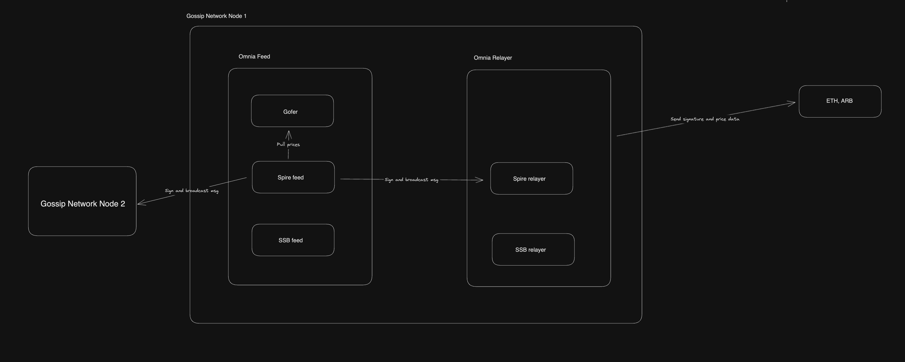
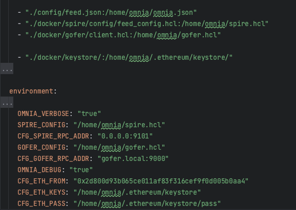
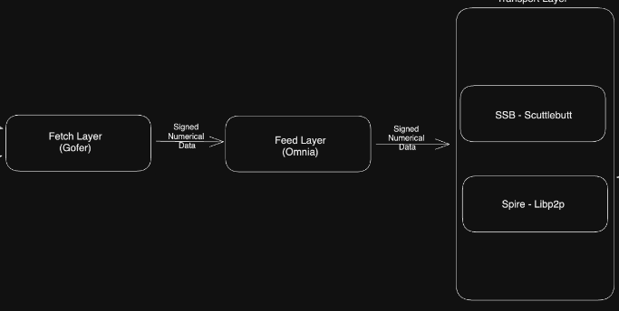

# Intro
### Omnia
An oracle client written in bash. It has 2 services feed and relay.

This repository only has the code for omnia feed service.

### Spire / SSB
P2P gossip network layer. Spire is built on libp2p whereas SSB is built on scuttlebutt.

### Gofer / Setzer
Tools used to fetch prices from different configured sources like reservoir.


    Omnia has 2 parts/services -> feed and relay
### Omnia feed
- Responsibility is to pull prices from Gofer/Setzer, sign with private key and publish to transport layer (spire/ssb)
### Omnia relay 
- Responsibility is to listen to new messages in the transport layer and include the pricing data and signatures in a single ethereum transaction and publish on chain)
- This is now separated in a different repo [here](https://github.com/soodup/omnia-relay/blob/master/omnia/docker-compose.yml).



#### Note
- Spire, Setzer and gofer are on separate [repo](https://github.com/soodup/oracle-suite/blob/v0.10.0) (gofer and spire are written in Golang) 
- Transport layer is just p2p gossip network layer (spire for libp2p, ssb for scuttlebutt)

# Quickstart
****
1.) Just `docker-compose build` and `docker-compose up -d` (docker-compose.yml)

2.) Start the spire agent in the docker container terminal by -` spire agent -c '/home/omnia/spire.hcl'`

3.) Start the gofer agent in the docker container terminal by -` gofer agent -c '/home/omnia/gofer.hcl'`

#### What happens exactly?
Current docker-compose starts an omnia feed container which has gofer and spire-feed installed.

- `omnia_feed` uses a static JSON defined in "omnia/exec/source-gofer" for now
  and signs and sends it to gossip network via `spire` over rpc.

- `spire agent` listens and broadcasts this message over the p2p network over tcp.

****

# Build and Run
1.) Check/Change the tag/sha to build and run a specific source for omnia/spire/gofer in the `Dockerfile`

2.)  `docker-compose build` and `docker-compose up -d` (docker-compose.yml)

This will build from `Dockerfile` which downloads a specified tagged source from github and builds all services.
### Docker Compose Config


- `./config/feed.json` is the main config for our omnia container. This specifies -
  - `ethereum` -> account address we use to sign the message
  - `pairs` -> pairs or feeds that are whitelisted
  - `sources` -> sources we fetch from (like Gofer)
  - `transports` -> transport we use for gossip network (like spire)
  - `options.interval` -> cron duration to fetch prices


- `./docker/spire/config/feed_config.hcl` is the spire config which will be used by omnia. It specifies -
  - `feeds` and `spire.pairs` -> whitelisted feeds and pairs that are used to send price updates
  - `ethereum` -> account address and keys that are used to sign messages over p2p network
  - `listen_addrs` -> listen over tcp network for other nodes  
  - `bootstrap_addrs` -> bootstrap some nodes in the network to receive messages and join a gossip network.


- `./docker/gofer/client.hcl` is the gofer config which will be used by omnia. It specifies -
  - `origin` -> the origin to fetch a price pair from (like sushiswap)
  - `price_model` -> min sources and method to use to fetch each pair (like get median price from 3 origins of BTC/USD)


- `./docker/keystore/` contains the signing account address, keys and pass for our oracle client
  - `CFG_ETH_FROM` -> env variable that defines the address which will be used to sign
  - `CFG_ETH_KEYS` -> env variable that contains the keys of this address
  - `CFG_ETH_PASS` -> env variable that contains the password of this address
  - This account address should be present in the `omnia relayer` container to be whitelisted so it can receive a message from this omnia node

3.) Start the spire agent in the docker container terminal by -` spire agent -c '/home/omnia/spire.hcl'`

or 

```bash
$ docker-compose -f docker-compose.yml exec -d omnia_feed sh -c "spire agent -c '/home/omnia/spire.hcl'"
```


4.) Start the gofer agent in the docker container terminal by -` gofer agent -c '/home/omnia/gofer.hcl'`

or 
```bash
$ docker-compose -f docker-compose.yml exec -d omnia_feed sh -c "gofer agent -c '/home/omnia/gofer.hcl'"
```

#### This will send a sample price (cryptopunks appraisal) to the gossip network every 60 seconds. To run the omnia-relay container to receive this price and send on chain please run it from [here](https://github.com/soodup/omnia-relay/blob/master/omnia/docker-compose.yml) 
(`omnia-relay` container).
****


# How to Dev
We have `docker-compose-dev.yml` which spins up gofer and spire containers separately instead of running it in embedded mode in omnia container to debug better like the below diagram.

### Source Code
- Omnia 
  - `omnia/lib` has the common functions that are used to run omnia feed
  - `omnia/exec` has the source to trigger commands for other services like gofer fetch, spire push)

- Spire, we need to change and build from [here](https://github.com/soodup/oracle-suite/blob/v0.10.0/docker-compose-spire.yaml
) (Use Dockerfile-spire)

After we change any source code we can just build and run the particular container and check if it works as expected.



# Omnia 


[](https://github.com/chronicleprotocol/omnia/actions/workflows/test.yml)
[](https://github.com/chronicleprotocol/omnia/actions/workflows/docker.yml)

For more information on running oracles see: https://github.com/chronicleprotocol/oracles


### Omnia Configuration
Current environment variables used are defined in the `docker-compose.yml`.

Dockerized Omnia default configuration:

| Env Var        | Default value            | Description                        |
|----------------|--------------------------|------------------------------------|
| `OMNIA_CONFIG` | `/home/omnia/omnia.json` | Omnia configuration file           |
| `SPIRE_CONFIG` | `/home/omnia/spire.json` | Spire configuration file           |
| `GOFER_CONFIG` | `/home/omnia/gofer.json` | Gofer configuration file           |
| `ETH_GAS`      | `7000000`                | Gofer configuration file           |


To set custom configuration values use [ENV (environment variables)](https://docs.docker.com/engine/reference/run/#env-environment-variables)

Example:

```bash
$ docker run -e "ETH_GAS=28282828282" -e "OMNIA_INTERVAL=15" ghcr.io/chronicleprotocol/omnia:latest
```

Configuration files might be provided by mounting it into Docker container. 

Example: 

Replacing existing file:

```bash
$ docker run -v $(pwd)/omnia_config.json:/home/omnia/omnia.json ghcr.io/chronicleprotocol/omnia:latest
```

Setting new configuration file:
You will have to rewrite `OMNIA_CONFIG` env var.

```bash
$ docker run -v $(pwd)/omnia_config.json:/home/omnia/omnia_config.json -e OMNIA_CONFIG=/home/omnia/omnia_config.json ghcr.io/chronicleprotocol/omnia:latest
```
